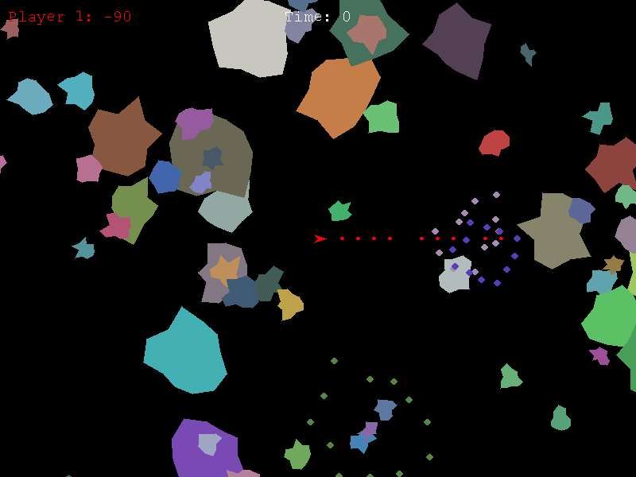

# space-rocks


#### Installation
To install the necessary game module,

`pip install pygame`

#### Running it
To run the game,

`python game.py`

#### Keys
In menu,

```
1 = Play 1 player game
2 = Play 2 player game 
```
In game,
```
Player 1
Z = Rotate anticlockwise
X = Rotate clockwise
A = Fire gun

Player 2
← (left cursor key) = Rotate anticlockwise
→ (right cursor key) = Rotate clockwise
/ (forward slash key) = Fire gun

ESC = Return to menu
```


#### Sound Effects
Used under creative commons license.

https://freesound.org/people/sharesynth/sounds/341235/  
https://freesound.org/people/ryansnook/sounds/110115/  
https://freesound.org/people/tommccann/sounds/235968/


